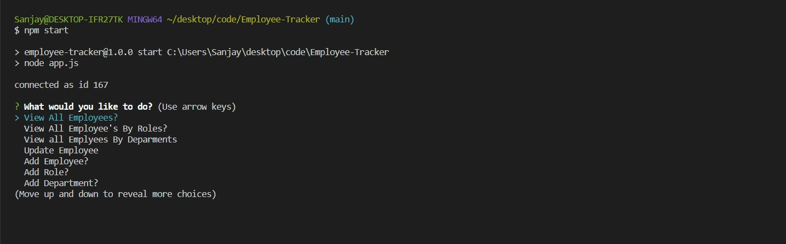
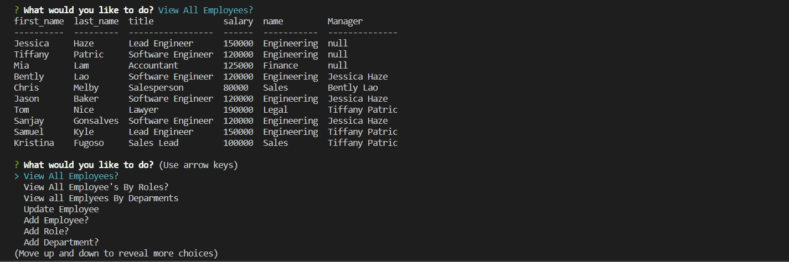
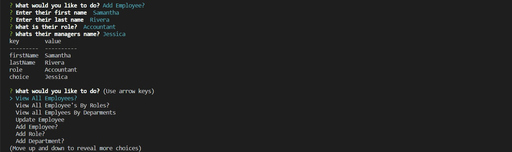

# Title
Employee-Tracker

## Description 
This project was designed as a homework assignment for UCSD Extension Web Development bootcamp.
  
The Employee Tracker is a command-line-input application run inNode.js command line based employee management system with basic commands to add and manage Employees, Roles and Departments.

# Getting Started
This project has been deployed to GitHub Pages. To get this project up and running, you can follow the deployment link.

   * [GitHub Respository](https://github.com/sanjay1626/Employee-Tracker.git) 
  

# Installation
To install this application, you will need a text editor. I recommend Visual Studio Code.
Install the required packages via "npm install" in the root directory (location of packages.json)
  
The application itself can be invoked with `npm start`.

## Usage
+ Program is run by executing "npm start" The user is brought to a main menu with a list of commands that can be execute. Some options have further choices and prompts to interact with the system.

+ Sample of database

+ Sample add Employee

# Preview

## License

MonkeyBrain Inc. 

---
# Languages

  * Node.js
  * MySQL
  
=======
  * JavaScript
  * Node.js
  * ES6
  * OOP

## Questions?

 

Feel free to contact me with examples or any questions via the information below:

GitHub: [@sanjay1626](https://api.github.com/users/sanjay1626)

Email: snjgonsalves@gmail.com
